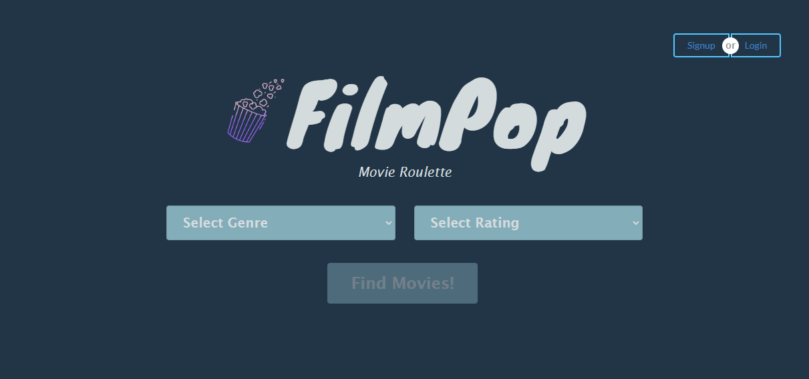
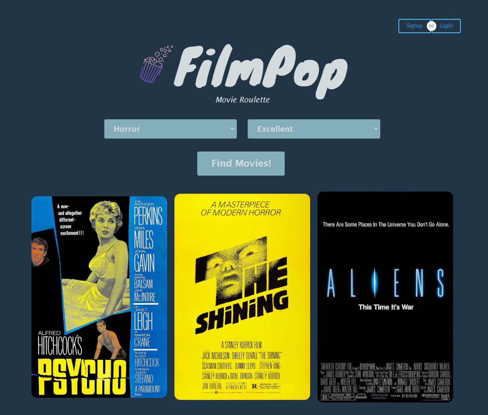
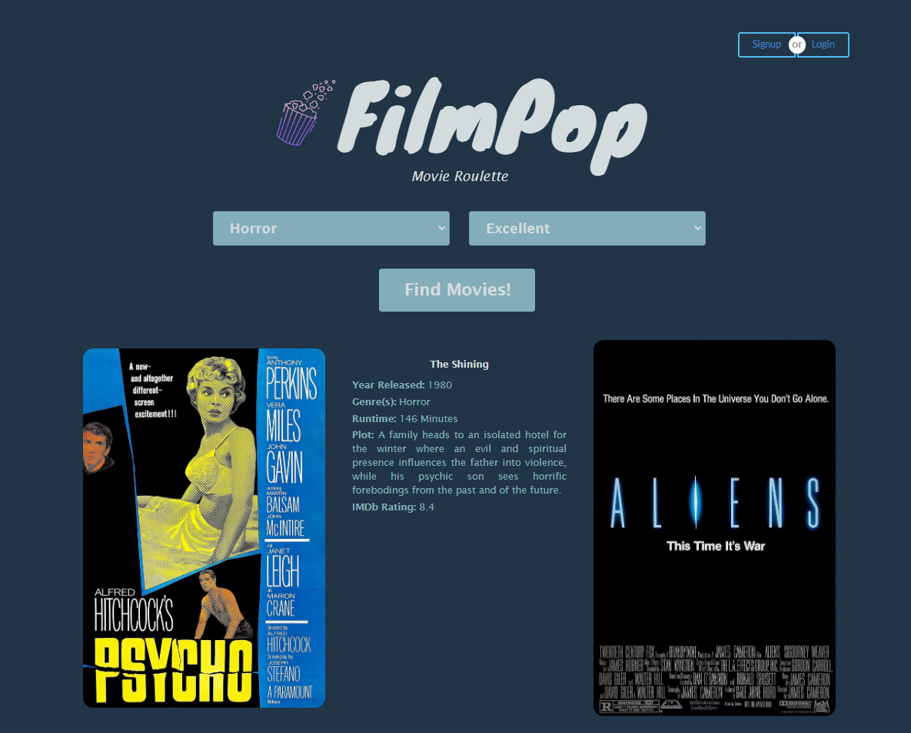
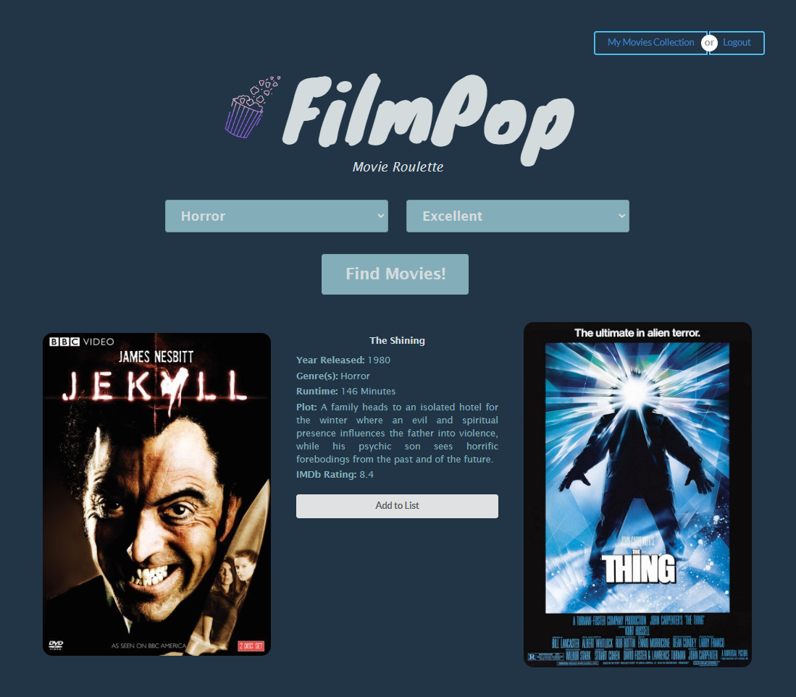
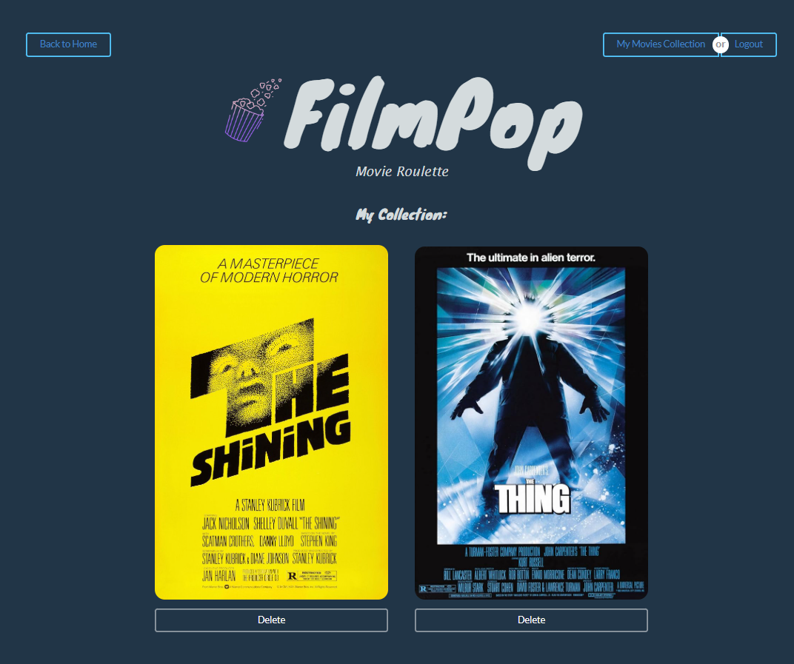

## Table Of Contents

- [Description](#description)
- [Technologies Used](#technologiesused)
- [Features](#features)
- [Installation](#installation)
- [Usage](#usage)
- [Credits](#credits)
- [Resources](#resources)
- [License](#license)

## Description

FilmPop was created to provide an engaging and user-friendly way for movie enthusiasts to discover new films tailored to their preferences. In an age where entertainment options are abundant, people often feel overwhelmed by the sheer volume of movie choices available. By focusing on two key factors — genre and rating — FilmPop simplifies the decision-making process, ensuring users find movie recommendations that align with their tastes. The inclusion of randomness in the search results adds an element of surprise and excitement, making each search unique and encouraging users to explore movies they might not have considered otherwise.

FilmPop is particularly useful for individuals seeking quick and convenient recommendations without the need to sift through lengthy lists or read extensive reviews. By narrowing results to just 3 movies per search, the app avoids decision fatigue and promotes spontaneity in movie selection. This makes it ideal for busy users who want to quickly plan a movie night or discover hidden gems within their favorite genres. Additionally, FilmPop's intuitive design and interactive functionality demonstrate how technology can enhance entertainment discovery, bridging the gap between user preferences and content in a seamless and enjoyable way.

## Technologies Used

- React Framework
- Semantic UI React
- JavaScript
- JSON Web Token
- CSS
- Apollo Client & Server (GraphQL)
- ExpressJS
- MongoDB
- Mongoose ODM
- Render for deployment

## Features

FilmPop is easy to use, and users can find movies without signing up for an account. Simply select a genre and a movie rating, then click "Find Movies!". The search will return 3 random movies based on the user's criteria. If the results don't meet the user's needs, they can click the search button again and another 3 random movies will be displayed. When the user hovers over each movie, it's year released, list of genres, runtime, plot summary, and IMDb rating are revealed.

If the user chooses to create an account, they'll be able to save movies to a "My Movies" list. This allows the user to curate a collection of movies to watch at a later time. If a movie from that list comes up in another search, the "Add to List" button will be disabled and rendered as "Saved to My Movies". Movies can also be deleted from the "My Movies" list. 

## Installation

To render the app locally, install Node.js to be used within your CLI. FilmPop is also available at the Render link below.

Render Deployment:
https://film-pop-be8b.onrender.com/

GitHub Repository:
https://github.com/qbres333/film-pop

## Usage

From the root directory of the app, enter the following commands in your CLI:
- npm run install
- npm run seed
- npm run build
- npm run start

The link to the app will display as "http://localhost:3000/" in the CLI and browser.

## Credits

* [Finola McBurnie](https://github.com/qbres333)
* [Yin Wu](https://github.com/yinwu173)

## Resources

* [React Router - Function useLocation](https://api.reactrouter.com/v7/functions/react_router.useLocation.html)
* [Semantic UI React](https://react.semantic-ui.com/)
* [GraphQL Queries](https://www.apollographql.com/docs/react/data/queries)
* [GraphQL Hooks](https://www.apollographql.com/docs/react/api/react/hooks#usequery)
* [GraphQL Query Fetch Policy](https://www.apollographql.com/docs/react/data/queries#setting-a-fetch-policy)
* [MERN Stack Tutorial](https://www.youtube.com/watch?v=Jcs_2jNPgtE&t=718s&ab_channel=AustinDavis)
* [GraphQL Refetching Queries](https://www.apollographql.com/docs/react/data/refetching)
* [GraphQL Mutations](https://www.apollographql.com/docs/react/data/mutations)

## License

MIT License - see the LICENSE file for details.
